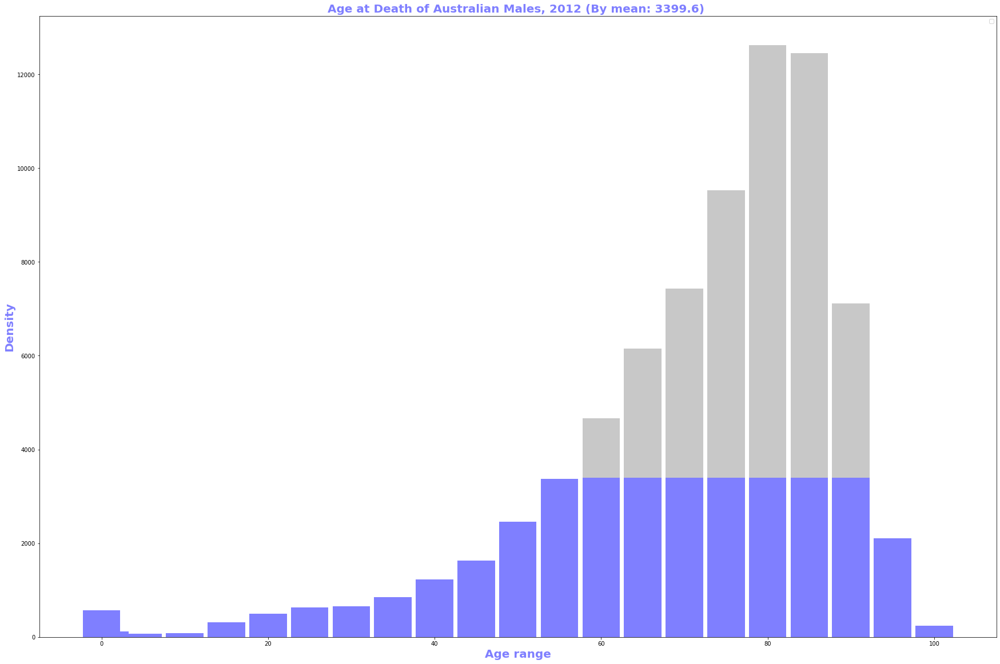

<h2><ins>Spark performance metrics:</ins></h2>

<h3><ins>Average vs Median & Percentiles:</ins></h3>
These were especially useful when we want to extract simple but also gives a very great insights from millions or thousands of 
millions metrics data.

<h4><ins>Median:</ins></h4>
Middle value separating the greater and lesser halves of a data set. Median is very useful when it comes to 
performance data, since it only represents what half of job will experience. Ideally median can be seen has a stable 
measurement, so it's good fit for seeing long-term trends. It was sort of 50 percentile.

Example usage:
As a median is based on the middle data in a set, it is not necessary to know the value of extreme results in order to 
calculate it. For example, in a psychology test investigating the time needed to solve a problem, if a small number of 
people failed to solve the problem at all in the given time a median can still be calculated.

___

<h4><ins>Percentiles:</ins></h4>
k-th percentile (percentile score or centile) is a score below which a given percentage k of scores in its frequency 
distribution falls. For example, the 50th percentile (the median) is the score below which (exclusive) or at or below 
which (inclusive) 50% of the scores in the distribution may be found.

<ins>Applications:</ins>
* The 85th percentile speed of traffic on a road is often used as a guideline in setting speed limits and assessing 
whether such a limit is too high or low.

* In finance, value at risk is a standard measure to assess (in a model-dependent way) the quantity under which the value 
of the portfolio is not expected to sink within a given period of time and given a confidence value.

<h4><ins>75th - 85th percentiles:</ins></h4>
Is a good choice for seeing medium- to long-term trends. It also the best value to use when setting performance budgets.

___
<h4><ins>90th - 95th percentiles:</ins></h4>
It is useful for finding short-term trends or anomalies.

<h4><ins>Average:</ins></h4>
Average are the best useful when the distribution is relatively even like ram or cpu metrics (as Spark cluster usage is 
pretty stand). Best try to use Average sparingly as it greatly inflate or deflate values.

___

Due to the caveat mentioned above, we recommend that you use averages sparingly. Average is roughly the same as the 66th percentile.
So 50 percentile & average metrics represents two completely different values.

<h4><ins>References:</ins></h4>
https://en.wikipedia.org/wiki/Percentile

<h4><ins>License</ins></h4>
Free to use

