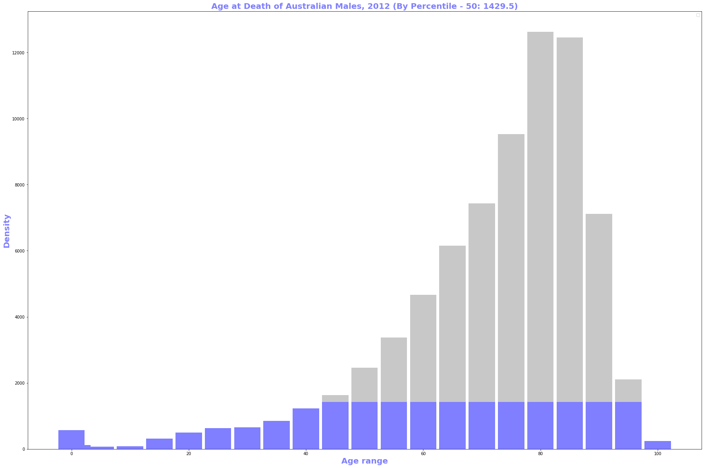
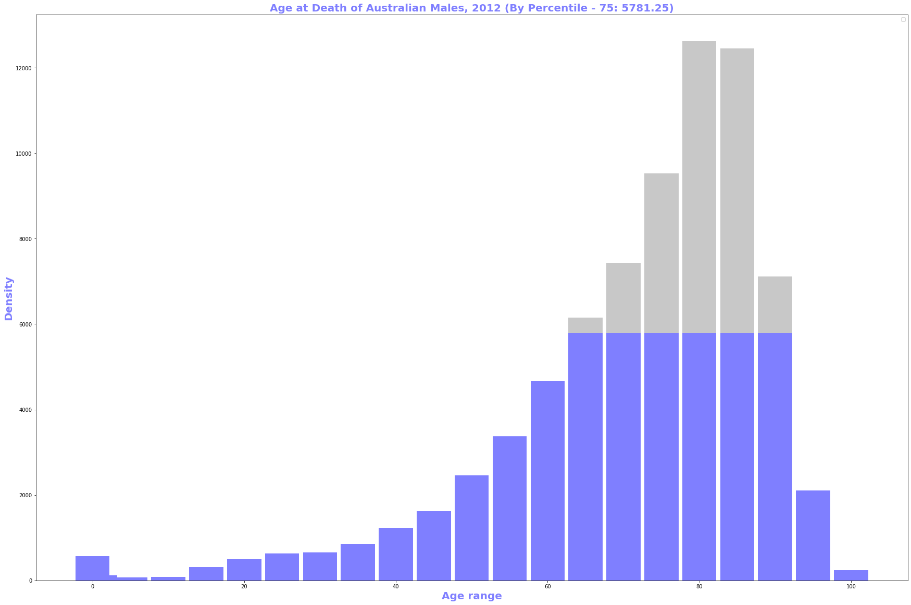
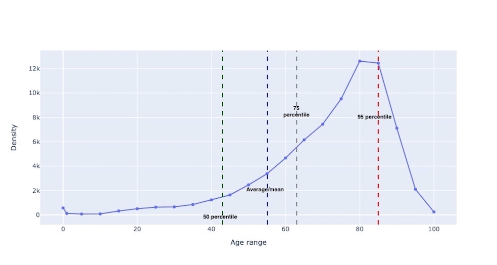

<h2><ins>Which function to consider Average vs Percentiles:</ins></h2>
These functions are very simple to use/implement, but also provides great insights from metrics data.

<h4><ins>Median/50 percentile:</ins></h4>
Middle value separating the greater and lesser halves of a data set. Median is very useful when it comes to performance 
data, since it only represents what half of the job will experience. Ideally, median can be seen has a stable 
measurement, so it is a good fit for seeing long-term trends. It was sort of <b>
50 percentile</b>.

Example usage:
As a median is based on the middle data in a set, it is not necessary to know the value of extreme results in order to 
calculate it. For example, in a psychology test investigating the time needed to solve a problem, if a small number of 
people failed to solve the problem at all in the given time a median can still be calculated.

___

<h4><ins>Percentiles:</ins></h4>
k-th percentile (percentile score or percentile) is a score below which a given percentage k of scores in its frequency 
distribution falls. For example, the 50th percentile (the median) is the score below which (exclusive) or at or below 
which (inclusive) 50% of the scores in the distribution may be found.

<ins>Applications:</ins>
* The 85th percentile speed of traffic on a road is often used as a guideline in setting speed limits and assessing 
whether such a limit is too high or low.

* In finance, value at risk is a standard measure to assess (in a model-dependent way) the quantity under which the value 
of the portfolio is not expected to sink within a given period of time and given a confidence value.

<h4><ins>75th - 85th percentiles:</ins></h4>
It gives a view or forecast of medium to long term trends. Thereby we can reprovision resources like hardware, budgets etc..

___
<h4><ins>90th - 95th percentiles:</ins></h4>
It is useful for finding short term trends or abrupt scenarios or anomalies.

___

<h4><ins>Average/Mean:</ins></h4>
Average/Mean are the best useful when the distribution is relatively even like system metrics (as Spark cluster usage is 
pretty stand). But try to use Average sparingly as it may greatly under or upper values.

Due to the caveat mentioned above, below figure show average is roughly the same as the 66th percentile.
So 50 percentile & average metrics represents two completely different values.

<h4><ins>References:</ins></h4>
https://en.wikipedia.org

<h4><ins>License</ins></h4>
Free to use

